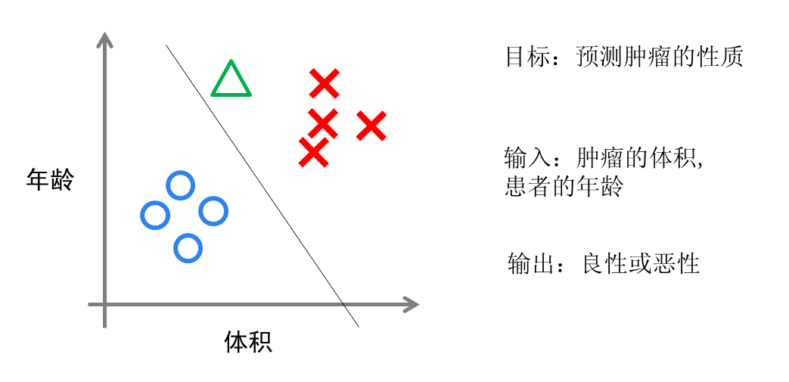

神经网络和深度学习(Neural Networks and Deep Learning)
==============================================================
### 1.1 欢迎(Welcome)

这一节课相对比较简单，这里讲了深度学习的价值以及能做什么事情。
我这边顺便给大家回顾一下“机器学习”的一些基本知识，可能对你理解和深度学习的异同有帮助。上来仍然抛出一个比较好的引用：

[简谈机器学习](https://www.cnblogs.com/subconscious/p/4107357.html) 

机器学习方法是计算机利用已有的数据(经验)，得出了某种模型(规律)，并利用此模型预测未来(结论概率)的一种方法。

常见的机器学习方法：

1. 线性回归
        
        一般会用[最小二乘法](Least squares)来解决。
        最小二乘法（又称最小平方法）是一种数学优化技术。它通过最小化误差的平方和寻找数据的最佳函数匹配。利用最小二乘法可以简便地求得未知的数据，并使得这些求得的数据与实际数据之间误差的平方和为最小。最小二乘法还可用于曲线拟合。其他一些优化问题也可通过最小化能量或最大化熵用最小二乘法来表达。
        个人理解最小二乘法的本质就是下面这个公式：
        $\sum_{i=0}^n$

        

2. 逻辑回归

感兴趣的可以自行搜索一些材料，这里给出我觉得比较好的一些引用。

[维基百科]( https://zh.wikipedia.org/wiki/%E6%B7%B1%E5%BA%A6%E5%AD%A6%E4%B9%A0)

[5分钟搞懂什么是深度学习](https://www.jianshu.com/p/27e9f1451882)

### 1.2 什么是神经网络？(What is a Neural Network)

我们常常用深度学习这个术语来指训练神经网络的过程。有时它指的是特别大规模的神经网络训练。啥是神经网络，这里再给一个完整的引用可以讲清楚关于神经网络的前世今生。

神经网络浅讲：从神经元到深度学习：https://www.cnblogs.com/subconscious/p/5058741.html

