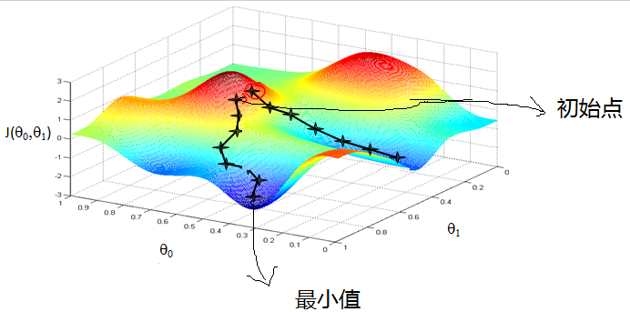

神经网络和深度学习(Neural Networks and Deep Learning)
==============================================================
### 1.1 欢迎(Welcome)

这一节课相对比较简单，这里讲了深度学习的价值以及能做什么事情。

我这边顺便给大家回顾一下“机器学习”的一些基本知识，可能对你理解和深度学习的异同有帮助。上来仍然抛出一个比较好的引用：

[简谈机器学习](https://www.cnblogs.com/subconscious/p/4107357.html) 

机器学习方法是计算机利用已有的数据(经验)，得出了某种模型(规律)，并利用此模型预测未来(结论概率)的一种方法。

#### 常见的机器学习方法
**机器学习的基本框架大都是模型、目标和优化算法**
所以我们在理解机器学习算法的时候先要理解数据集的特点和分布。首先是选定模型，接下来根据选定的模型根据你的目标来找到损失函数从而更好的拟合数据，最后是选定完成这次拟合的优化算法来达成目标。

1. 线性回归

    - 一般会用[最小二乘法]来解决。简单说就是为了达到以下的公式为目的，使得所有误差的平方和最小。
        
        最小二乘法（又称最小平方法）是一种数学优化技术。它通过最小化误差的平方和寻找数据的最佳函数匹配。利用最小二乘法可以简便地求得未知的数据，并使得这些求得的数据与实际数据之间误差的平方和为最小。最小二乘法还可用于曲线拟合。其他一些优化问题也可通过最小化能量或最大化熵用最小二乘法来表达。

    - 用矩阵求解的方式直接计算
        其实根本不用把最小二乘法想的多么高大上，不就是求极值嘛。学过大学高等数学的人应该都知道求极值的方法：就是求偏导，然后使偏导为0，这就是最小二乘法整个的方法了，so easy。

        
        最后使所有的偏导等于0

        

        然后解这个方程组就可以得到各个系数的值了。
        然而是否可以用最小平方来衡量loss函数的合理性，可以用最大似然来衡量。
        [极大似然估计详解](https://blog.csdn.net/zengxiantao1994/article/details/72787849)

    - 梯度下降法求解最小二乘（Gradient Descent）
        相比于最小二乘线性回归的方法，梯度下降算法可以用梯度迭代的模式来完成最小二乘的求解，否则线性回归求解一个巨大的方程组在计算复杂度和可行性上都不符合现实情境。
        同样引入比较好的引用链接：

        [梯度下降（Gradient Descent）小结](https://www.cnblogs.com/pinard/p/5970503.html)

        [深入浅出--梯度下降法及其实现](https://www.jianshu.com/p/c7e642877b0e)

        首先来看看梯度下降的一个直观的解释。比如我们在一座大山上的某处位置，由于我们不知道怎么下山，于是决定走一步算一步，也就是在每走到一个位置的时候，求解当前位置的梯度，沿着梯度的负方向，也就是当前最陡峭的位置向下走一步，然后继续求解当前位置梯度，向这一步所在位置沿着最陡峭最易下山的位置走一步。这样一步步的走下去，一直走到觉得我们已经到了山脚。当然这样走下去，有可能我们不能走到山脚，而是到了某一个局部的山峰低处。

        从上面的解释可以看出，梯度下降不一定能够找到全局的最优解，有可能是一个局部最优解。当然，如果损失函数是凸函数，梯度下降法得到的解就一定是全局最优解。

        

        梯度是微积分中一个很重要的概念，之前提到过梯度的意义

        - 在单变量的函数中，梯度其实就是函数的微分，代表着函数在某个给定点的切线的斜率
        - 在多变量函数中，梯度是一个向量，向量有方向，梯度的方向就指出了函数在给定点的上升最快的方向

        这里引入一个概念学习率 或者 叫步长（Learning rate）：步长决定了在梯度下降迭代的过程中，每一步沿梯度负方向前进的长度。用上面下山的例子，步长就是在当前这一步所在位置沿着最陡峭最易下山的位置走的那一步的长度。

        梯度下降算法的实现

        首先，我们定义一个代价函数，在此我们选用最小二乘的均方误差代价函数。
        
        

        此公式中 
        m是数据集中点的个数 
        ½是一个常量，这样是为了在求梯度的时候，二次方乘下来就和这里的½抵消了，自然就没有多余的常数系数，方便后续的计算，同时对结果不会有影响 
        y 是数据集中每个点的真实y坐标的值 
        h 是我们的预测函数，根据每一个输入x，根据Θ 计算得到预测的y值，即

        

        我们可以根据代价函数看到，代价函数中的变量有两个，所以是一个多变量的梯度下降问题，求解出代价函数的梯度，也就是分别对两个变量进行微分

        

        明确了代价函数和梯度，以及预测的函数形式。我们就可以开始编写代码了。但在这之前，需要说明一点，就是为了方便代码的编写，我们会将所有的公式都转换为矩阵的形式，python中计算矩阵是非常方便的，同时代码也会变得非常的简洁。

        [具体代码](./gradient_descent.py)可以见同目录下的[gradient_descent.py]

2. 逻辑回归

    逻辑回归是一种与线性回归非常类似的算法，但是，从本质上讲，线型回归处理的问题类型与逻辑回归不一致。线性回归处理的是数值问题，也就是最后预测出的结果是数字，例如房价。而逻辑回归属于分类算法，也就是说，逻辑回归预测结果是离散的分类，例如判断这封邮件是否是垃圾邮件，以及用户是否会点击此广告等等。

    实现方面的话，逻辑回归只是对对线性回归的计算结果加上了一个Sigmoid函数，将数值结果转化为了0到1之间的概率(Sigmoid函数的图像一般来说并不直观，你只需要理解对数值越大，函数越逼近1，数值越小，函数越逼近0)，接着我们根据这个概率可以做预测，例如概率大于0.5，则这封邮件就是垃圾邮件，或者肿瘤是否是恶性的等等。从直观上来说，逻辑回归是画出了一条分类线，见下图。

#### 关于深度学习

感兴趣的可以自行搜索一些材料，这里给出我觉得比较好的一些引用。

[维基百科](https://zh.wikipedia.org/wiki/%E6%B7%B1%E5%BA%A6%E5%AD%A6%E4%B9%A0)

[5分钟搞懂什么是深度学习](https://www.jianshu.com/p/27e9f1451882)

### 1.2 什么是神经网络？(What is a Neural Network)

我们常常用深度学习这个术语来指训练神经网络的过程。有时它指的是特别大规模的神经网络训练。啥是神经网络，这里再给一个完整的引用可以讲清楚关于神经网络的前世今生。

神经网络浅讲：从神经元到深度学习：https://www.cnblogs.com/subconscious/p/5058741.html

